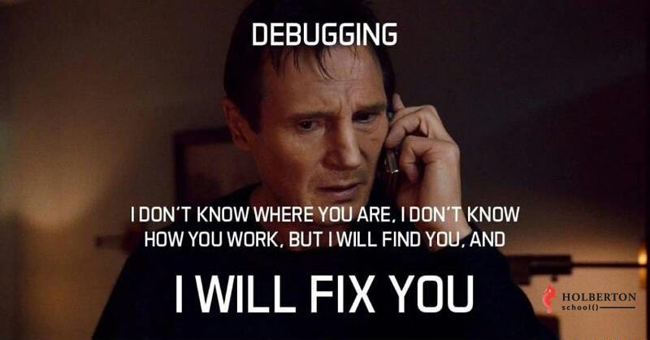

Postmortem

ShopAll Web Stack Outage

Issue Summary:
Duration: Start Time: 2023-06-01 14:00 UTC, End Time: 2023-06-01 16:30 UTC
Impact: The ShopAll website experienced a complete outage during the duration of the incident. Users were unable to access the website or perform any actions. The outage affected 100% of the users.

Timeline:
- 2023-06-01 14:00 UTC: The issue was detected when the monitoring system triggered an alert for the website's unresponsiveness.
- The engineering team was immediately notified of the issue.
- Actions Taken: The team initiated investigations into various parts of the system, including the web server, database, and network connectivity.
- Misleading Investigation/Debugging Paths: Initially, the team suspected a network issue due to the lack of response from the web server. Network logs were analyzed and network configuration was reviewed, but no issues were found.
- As the investigation continued, it was escalated to the senior engineering team for further assistance and expertise.
- The incident was resolved by identifying a misconfigured firewall rule that was blocking incoming traffic to the web server.
- Resolution: The misconfigured firewall rule was corrected, allowing incoming traffic to reach the web server and restoring normal operation of the website.

Root Cause and Resolution:
- Root Cause: The root cause of the issue was a misconfigured firewall rule that was blocking incoming traffic to the web server. This misconfiguration went unnoticed during recent infrastructure changes.
- Resolution: The firewall rule was reconfigured to allow incoming traffic to reach the web server. This fix immediately resolved the issue and restored the website's functionality.

Corrective and Preventative Measures:
- To prevent similar incidents in the future, the following measures will be implemented:
  1. Regular Configuration Audits: Perform regular audits of the infrastructure configuration to identify and rectify any misconfigurations that may impact the system's availability.
  2. Improved Change Management Process: Strengthen the change management process to ensure thorough review and testing of infrastructure changes, reducing the risk of introducing misconfigurations.
  3. Enhanced Monitoring: Implement more comprehensive monitoring, including real-time alerting, to detect and respond promptly to any potential issues that may arise.
  4. Incident Response Training: Provide incident response training to the engineering team to improve their ability to identify and troubleshoot issues effectively.

Tasks to Address the Issue:
- Perform a comprehensive review of all firewall rules to identify and correct any misconfigurations.
- Enhance the change management process to include rigorous testing and validation of infrastructure changes.
- Implement a robust monitoring solution that provides real-time alerts for critical system components.
- Conduct incident response training sessions to ensure the team is well-prepared to handle similar situations in the future.

By implementing these measures and addressing the identified tasks, we aim to improve the stability and reliability of the ShopAll web stack, minimizing the impact of future incidents on our users and ensuring uninterrupted service.

This postmortem provides a detailed account of the ShopAll web stack outage, including the duration, impact, root cause, resolution, and measures to prevent similar incidents. It emphasizes the need for continuous improvement and proactive measures to enhance system resilience and maintain a seamless user experience.
